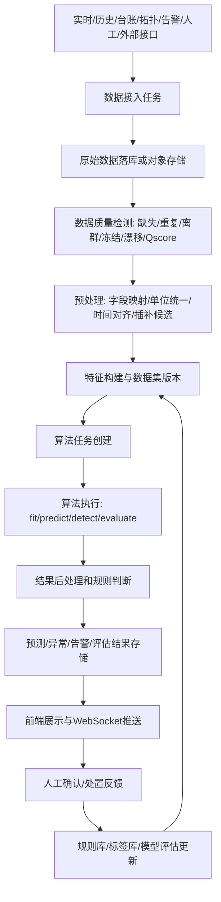
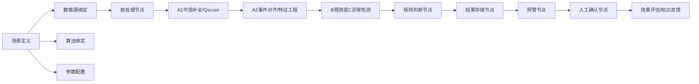
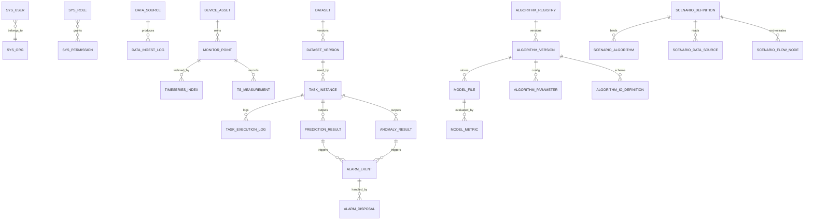

# 智能水务算法应用平台需求规格与技术设计

版本：V1.0  
生成时间：2026-07-15T23:29:36  
依据文件：`C:\Users\LH\Desktop\1025(2).pdf`、`F:\dataspace\供水-张家口` 只读扫描结果  
输出目录：`F:\dataspace\供水-张家口-analysis-output`

## 0. 设计边界与结论

本平台不是单个算法脚本，而是面向供水、水处理、排水实时监测业务的算法管理与场景应用平台。第一阶段完整开发 PDF 最后给出的两个典型案例：`案例1：供水管网漏损控制与评定`、`案例2：城市内涝预警报警与指挥调度`。其余 10 个业务场景通过数据库记录、场景注册接口、菜单路由、参数配置、算法绑定、数据源绑定、结果组件、权限、调度和日志接口进行预留。

已扫描本地数据目录 `F:\dataspace\供水-张家口`，共 582 个文件，438.42 MB，其中 Excel 574 个、zip 8 个。扫描只读执行，未修改原始目录。第一阶段案例1已有较强数据基础：15分钟压力/流量修复样本、分区/小区/水表台账、远传表日读数、机械表月读数、管网拓扑模型。案例2目前主要来自 PDF 场景规划，需补充排水、气象、泵站、积水点和预案数据。

## 一、总体设计

### 1.1 建设目标

平台形成“数据接入 -> 数据治理 -> 特征处理 -> 算法调用 -> 结果分析 -> 预警处置 -> 效果评估”的闭环。核心能力包括：

1. 接入实时监测、历史时序、设备台账、管网/工艺拓扑、水质、告警、人工录入、外部接口、模型训练和算法结果数据。
2. 管理统计分析、规则、传统机器学习、深度学习、异常检测、分类、聚类、补全、质量评估、概率预测、组合算法和第三方算法服务。
3. 支持算法注册、参数配置、训练、测试、部署、调用、监控、版本管理、下线和回滚。
4. 支持业务场景配置化编排，按场景绑定数据源、算法链、规则、任务调度、展示组件和权限。
5. 前端展示原始数据、数据质量、预测结果、异常检测、预警、模型准确率、运行状态和人工处置反馈。

### 1.2 12个业务场景清单

| 编码 | 场景名称 | 阶段 | 当前数据是否具备 | 业务目标 | 输入数据 | 核心算法 | 输出结果 | 用户角色 | 预期展示 | 需补充数据或规则 |
|---|---|---|---|---|---|---|---|---|---|---|
| S01 | 城镇供水管网漏损控制与评定 | 第一阶段完整开发 | 具备 | 漏损预警、定位、水平衡、评定、处置闭环 | 压力/流量时序、远传表累计水量、机械表月度抄表、小区-DMA-分区映射、管网拓扑、总表误差分析、告警/工单（待补充） | Qscore、A1可信补全、A2事件对齐、夜间最小流量、水平衡、B1/B2趋势与区间预测、C1/C2异常检测与溯因、规则库 | 漏损风险分区、候选漏损点、漏损率/CIJ评定、总分表差异、告警事件、处置建议、模型评估报告 | 调度员、漏损工程师、分区管理员、算法工程师、运维管理员 | 分区地图/拓扑、时序曲线、实际-预测对比、异常点、漏损排名、告警处置时间轴 | 需业务人员确认夜间合法用水量、漏损率口径、阈值、关阀规则、总分表层级。 |
| S02 | 城市内涝预警报警与指挥调度 | 第一阶段完整开发 | 部分具备 | 降雨-水位-流量预测、风险分级、调度建议 | 气象预报、雷达降雨、液位/积水点、管网流量/水位、泵站阀门状态、工单事件、SimuWater模型（多数需接入） | A1可信补全、A2事件对齐、Qscore、B1雨量-液位-流量趋势预测、B2概率区间、SimuWater动态边界、C1/C2异常监测与根因 | 内涝风险等级、风险区域、预测区间、泵闸联动建议、应急资源建议、事后评估 | 排水调度员、防汛指挥、泵站运维、应急处置人员、算法工程师 | 风险地图、降雨-液位-流量联动曲线、预案面板、泵闸状态、告警时间轴、评估报表 | 需补充排水监测、气象、泵站、积水点、预案、阈值和调度规则。 |
| S03 | 全流程饮用水水质安全保障 | 第二阶段重点开发 | 暂未充分发现 | 水质趋势、异常检测、达标预警 | 按场景绑定实时监测、历史时序、台账、规则、工单和外部系统接口；当前多为预留。 | 复用数据质量、预测、异常检测、分类、规则判断、场景编排机制；新增算法按统一接口注册。 | 水质趋势、异常检测、达标预警结果、风险/预警、任务日志、评估指标。 | 业务专员、调度员、运维人员、算法工程师、系统管理员 | 场景总览、参数配置、结果图表、告警处置、模型评估组件模板 | 需业务人员补充数据源、指标口径、规则阈值、验收标准。 |
| S04 | 城镇供水水量调度保障 | 第二阶段重点开发 | 部分具备 | 需求预测、供需平衡、调度辅助 | 按场景绑定实时监测、历史时序、台账、规则、工单和外部系统接口；当前多为预留。 | 复用数据质量、预测、异常检测、分类、规则判断、场景编排机制；新增算法按统一接口注册。 | 需求预测、供需平衡、调度辅助结果、风险/预警、任务日志、评估指标。 | 业务专员、调度员、运维人员、算法工程师、系统管理员 | 场景总览、参数配置、结果图表、告警处置、模型评估组件模板 | 需业务人员补充数据源、指标口径、规则阈值、验收标准。 |
| S05 | 供水全流程节能降耗 | 后续阶段预留 | 需补充 | 泵站能耗优化、压力-流量协同 | 按场景绑定实时监测、历史时序、台账、规则、工单和外部系统接口；当前多为预留。 | 复用数据质量、预测、异常检测、分类、规则判断、场景编排机制；新增算法按统一接口注册。 | 泵站能耗优化、压力-流量协同结果、风险/预警、任务日志、评估指标。 | 业务专员、调度员、运维人员、算法工程师、系统管理员 | 场景总览、参数配置、结果图表、告警处置、模型评估组件模板 | 需业务人员补充数据源、指标口径、规则阈值、验收标准。 |
| S06 | 供水资产生命周期健康管理 | 后续阶段预留 | 部分具备 | 设备健康评分、寿命预测 | 按场景绑定实时监测、历史时序、台账、规则、工单和外部系统接口；当前多为预留。 | 复用数据质量、预测、异常检测、分类、规则判断、场景编排机制；新增算法按统一接口注册。 | 设备健康评分、寿命预测结果、风险/预警、任务日志、评估指标。 | 业务专员、调度员、运维人员、算法工程师、系统管理员 | 场景总览、参数配置、结果图表、告警处置、模型评估组件模板 | 需业务人员补充数据源、指标口径、规则阈值、验收标准。 |
| S07 | 城镇供水智能优服管理 | 后续阶段预留 | 需补充 | 服务工单、投诉预测、用户画像 | 按场景绑定实时监测、历史时序、台账、规则、工单和外部系统接口；当前多为预留。 | 复用数据质量、预测、异常检测、分类、规则判断、场景编排机制；新增算法按统一接口注册。 | 服务工单、投诉预测、用户画像结果、风险/预警、任务日志、评估指标。 | 业务专员、调度员、运维人员、算法工程师、系统管理员 | 场景总览、参数配置、结果图表、告警处置、模型评估组件模板 | 需业务人员补充数据源、指标口径、规则阈值、验收标准。 |
| S08 | 排水系统溢流控制 | 第二阶段重点开发 | 需补充 | 溢流风险预测、调蓄调度 | 按场景绑定实时监测、历史时序、台账、规则、工单和外部系统接口；当前多为预留。 | 复用数据质量、预测、异常检测、分类、规则判断、场景编排机制；新增算法按统一接口注册。 | 溢流风险预测、调蓄调度结果、风险/预警、任务日志、评估指标。 | 业务专员、调度员、运维人员、算法工程师、系统管理员 | 场景总览、参数配置、结果图表、告警处置、模型评估组件模板 | 需业务人员补充数据源、指标口径、规则阈值、验收标准。 |
| S09 | 污水系统提质增效 | 后续阶段预留 | 需补充 | 入流入渗、浓度负荷、系统效能 | 按场景绑定实时监测、历史时序、台账、规则、工单和外部系统接口；当前多为预留。 | 复用数据质量、预测、异常检测、分类、规则判断、场景编排机制；新增算法按统一接口注册。 | 入流入渗、浓度负荷、系统效能结果、风险/预警、任务日志、评估指标。 | 业务专员、调度员、运维人员、算法工程师、系统管理员 | 场景总览、参数配置、结果图表、告警处置、模型评估组件模板 | 需业务人员补充数据源、指标口径、规则阈值、验收标准。 |
| S10 | 排水资产生命周期健康管理 | 后续阶段预留 | 需补充 | 管渠、泵闸、井室健康评估 | 按场景绑定实时监测、历史时序、台账、规则、工单和外部系统接口；当前多为预留。 | 复用数据质量、预测、异常检测、分类、规则判断、场景编排机制；新增算法按统一接口注册。 | 管渠、泵闸、井室健康评估结果、风险/预警、任务日志、评估指标。 | 业务专员、调度员、运维人员、算法工程师、系统管理员 | 场景总览、参数配置、结果图表、告警处置、模型评估组件模板 | 需业务人员补充数据源、指标口径、规则阈值、验收标准。 |
| S11 | 污水处理厂节能降耗 | 后续阶段预留 | 需补充 | 曝气、药耗、能耗优化 | 按场景绑定实时监测、历史时序、台账、规则、工单和外部系统接口；当前多为预留。 | 复用数据质量、预测、异常检测、分类、规则判断、场景编排机制；新增算法按统一接口注册。 | 曝气、药耗、能耗优化结果、风险/预警、任务日志、评估指标。 | 业务专员、调度员、运维人员、算法工程师、系统管理员 | 场景总览、参数配置、结果图表、告警处置、模型评估组件模板 | 需业务人员补充数据源、指标口径、规则阈值、验收标准。 |
| S12 | 排水户监管与污染溯源 | 后续阶段预留 | 需补充 | 异常排放识别、污染源追踪 | 按场景绑定实时监测、历史时序、台账、规则、工单和外部系统接口；当前多为预留。 | 复用数据质量、预测、异常检测、分类、规则判断、场景编排机制；新增算法按统一接口注册。 | 异常排放识别、污染源追踪结果、风险/预警、任务日志、评估指标。 | 业务专员、调度员、运维人员、算法工程师、系统管理员 | 场景总览、参数配置、结果图表、告警处置、模型评估组件模板 | 需业务人员补充数据源、指标口径、规则阈值、验收标准。 |

### 1.3 系统功能模块图说明

已生成可导入 draw.io 的 XML 文件：`系统功能模块图.drawio`。节点按 8 个层级分组：

- 数据资源层：蓝色，表示原始和结果数据资产。
- 数据接入层：青色，表示文件、数据库、API、WebSocket、MQTT、定时采集和日志。
- 数据治理与分析层：绿色，表示字段映射、时间对齐、质量评分、清洗、插补、特征工程和数据集版本。
- 算法中控层：橙色，表示算法注册、版本、参数、模型文件、训练、推理、评估、发布、监控、SDK/API封装。
- 场景编排层：紫色，表示场景注册、数据源绑定、算法绑定、流程节点、规则、预警、任务调度。
- 业务应用层：红色，12个业务场景；案例1/案例2用实线深色标记，其他场景用灰色虚线标记。
- 平台管理层：灰色，用户、角色、权限、菜单、字典、日志、通知、文件、服务监控。
- 前端展示层：靛蓝色，驾驶舱、监测、质量、算法、场景、任务、预测、异常、预警、处置、评估、系统管理。

主要连线关系：数据资源 -> 数据接入 -> 数据治理 -> 算法中控/场景编排 -> 业务应用 -> 前端展示；平台管理横向约束数据、算法、场景和前端权限；算法结果回写数据资源层并触发预警处置和模型评估。

### 1.4 系统技术架构

```mermaid
flowchart LR
  subgraph FE["前端 Angular"]
    A1["Angular + TypeScript"]
    A2["Router + Guards"]
    A3["NgRx/Signals 状态管理"]
    A4["ECharts/Topo/流程画布"]
    A5["WebSocket 实时刷新"]
    A6["动态菜单/动态表单/场景组件"]
  end
  subgraph API["Python 后端"]
    B1["FastAPI REST"]
    B2["Pydantic DTO/校验"]
    B3["SQLAlchemy ORM/Alembic"]
    B4["WebSocket Gateway"]
    B5["Celery Worker"]
    B6["APScheduler 调度器"]
    B7["算法服务适配器"]
    B8["权限/RBAC/审计"]
  end
  subgraph ALG["算法运行层"]
    C1["Python包直接调用"]
    C2["独立算法微服务"]
    C3["GPU推理服务 PyTorch"]
    C4["批量离线计算 Pandas/NumPy/sklearn"]
  end
  subgraph DATA["数据与基础设施"]
    D1["PostgreSQL + TimescaleDB"]
    D2["Redis 缓存/队列结果"]
    D3["MinIO 文件与模型"]
    D4["RabbitMQ/Kafka 消息"]
    D5["Nginx 反向代理"]
    D6["Docker/Linux/GPU服务器"]
  end
  FE <--> API
  API --> ALG
  API <--> DATA
  ALG --> DATA
```



技术选型说明：

- 前端采用 Angular，是因为其路由、模块化、表单和权限守卫适合大型管理平台；使用 TypeScript 保证接口类型一致；状态管理可选 NgRx 或 Angular Signals，第一阶段建议 Signals + 服务缓存，复杂跨页状态再引入 NgRx。
- 图表采用 ECharts，适合时序曲线、热力图、误差分布、混淆矩阵、仪表盘；拓扑图可采用 ngx-graph、AntV X6 或 ECharts graph，场景流程可采用 bpmn-js/LogicFlow。
- 后端采用 FastAPI，而不是 Django，原因是算法平台接口以 REST/WebSocket/异步任务为主，FastAPI 与 Pydantic、异步IO、OpenAPI 文档结合更轻。若甲方强依赖后台管理，可补充 Django Admin，但不作为主框架。
- SQLAlchemy + Alembic 负责业务库建模和迁移；Pydantic 负责请求/响应、算法 I/O schema 校验。
- Celery + Redis/RabbitMQ 处理训练、批量推理、质量分析、数据导入等耗时任务；APScheduler 只负责生成定时任务，不直接执行重计算。
- Redis 用于短期缓存、WebSocket订阅状态、任务状态快照；不存放长期结果。
- PostgreSQL 存业务表；TimescaleDB 存高频时序。若写入频率达到数十万点/秒或保留周期很长，再评估 InfluxDB。第一阶段建议 PostgreSQL + TimescaleDB，减少组件数量。
- MinIO 存模型文件、原始导入文件副本、报告、图片和日志附件。
- RabbitMQ 适合业务任务队列；Kafka 适合外部实时流量很大、多消费者的数据总线。第一阶段优先 RabbitMQ，保留 Kafka 适配器。
- Docker + Nginx + Linux 是常规部署基础。GPU服务器仅在深度学习训练/推理需要时启用，不作为所有服务依赖。

### 1.5 系统数据流图



### 1.6 场景编排架构



## 二、数据设计

### 2.1 本地数据扫描结论

本次扫描输出：

- `directory_inventory.csv`：文件清单。
- `directory_summary.json`：目录统计。
- `workbook_profiles.json`：Excel 工作簿画像。
- `数据质量分析报告.md`：数据质量初报。
- `字段业务字典待确认表.csv`：字段业务字典待确认表。
- `zip_inventory.csv`：zip归档清单。

关键数据结构：

- `修复结果_已替换.xlsx`：316225 行，字段包括设备名称、时间、压力(MPa)、流量(m³/h)、自动/人工流量压力、修复值和修复标记；时间范围样本为 2024-01-01 至 2024-01-11，采样间隔约 900 秒，可作为数据质量、补全、异常检测和预测样例。
- `三级-经开6-7.xlsx`：30 个工作表，含节点、管道、阀门、消防栓、监测设备等，节点 23700 行、管道 24234 行，可支撑拓扑、关阀、漏损定位和模型边界。
- `三级-经开9-2.xlsx`：20 个工作表，含节点、管道等模型台账。
- `分区.xlsx`：分区表、小区、监测设备表，是分区/DMA/监测点绑定入口。
- 小区工作簿如 `朗诗东山樾.xlsx`、`钻石花园.xlsx`：客户编码、水表IMEI、客户地址、口径、小区、DMA、一级/二级/三级分区。
- 远传表：533 个文件，字段包括 `time`、`voltage`、`valveStatus`、`signal`、`cumulFlow`、`address`、`lowBatteryAlarm`、`magIntAlarm`、`timeOfReading`、`snr`、`csq`、`cc`，多数为日级读数。
- 机械表：字段包括水费年月、客户编号、上月表数、本月表数、表计水量、收费水量、水费金额、上次抄表日期，多为月度数据。

### 2.2 时序数据存储策略

高频监测数据不能全部写入普通业务表。建议：

- 原始文件保存在 MinIO，记录导入批次和文件校验和。
- 15分钟、分钟级、秒级监测数据写入 TimescaleDB 超表 `ts_measurement`，按时间自动分区，按点位和指标建立复合索引。
- 对曲线展示建立连续聚合：1分钟、15分钟、1小时、1天；前端默认查询降采样结果。
- 业务表仅保存时序索引、质量结果、预测结果、异常结果和告警，不保存全部原始宽表。
- 对远传表日读数、机械表月读数，可先进入 TimescaleDB 或分区业务明细表，再统一映射为标准指标。

### 2.3 数据库ER图



### 2.4 数据库表设计

| 表名 | 中文名称 | 业务用途 | 核心字段/类型 | 索引与关系 | 第一阶段 |
|---|---|---|---|---|---|
| sys_user | 用户表 | 系统登录主体与人员信息 | id bigint PK；username varchar(64) UK；password_hash varchar(255)；display_name varchar(64)；org_id bigint FK；status varchar(16)；last_login_at timestamptz；created_at timestamptz | username唯一；org_id索引 | 是 |
| sys_role | 角色表 | 角色与权限分组 | id bigint PK；role_code varchar(64) UK；role_name varchar(64)；description text；status varchar(16) | role_code唯一 | 是 |
| sys_permission | 权限表 | 菜单、接口、按钮、数据权限点 | id bigint PK；perm_code varchar(128) UK；perm_type varchar(32)；resource varchar(255)；action varchar(32) | perm_code唯一；resource索引 | 是 |
| sys_org | 组织机构表 | 水司、部门、班组、项目组织 | id bigint PK；parent_id bigint FK；org_name varchar(128)；org_type varchar(32)；path ltree/text | parent_id；path | 是 |
| data_source | 数据源配置表 | 文件、数据库、API、WebSocket、MQTT、消息队列配置 | id bigint PK；source_code varchar(64) UK；source_name varchar(128)；source_type varchar(32)；conn_config jsonb；auth_config jsonb；owner_org_id bigint；status varchar(16) | source_type；status；owner_org_id | 是 |
| data_ingest_log | 数据接入日志表 | 每次采集/导入/同步记录 | id bigint PK；source_id bigint FK；task_id bigint；started_at timestamptz；ended_at timestamptz；status varchar(16)；rows_read int；rows_written int；error_message text | source_id,started_at；status | 是 |
| monitor_point | 监测点表 | 流量、压力、水位、水质、雨量等监测点主数据 | id bigint PK；point_code varchar(128) UK；point_name varchar(128)；point_type varchar(32)；device_id bigint FK；dma_id bigint；location geometry/jsonb；unit varchar(32)；sample_interval_sec int；status varchar(16) | point_code唯一；point_type；dma_id | 是 |
| device_asset | 设备台账表 | 水表、流量计、压力计、泵、阀、RTU等台账 | id bigint PK；device_code varchar(128) UK；device_name varchar(128)；device_type varchar(32)；manufacturer varchar(64)；model varchar(64)；install_date date；org_id bigint；metadata jsonb | device_code唯一；device_type；org_id | 是 |
| timeseries_index | 时序数据索引表 | 登记时序量存储位置、字段、保留策略 | id bigint PK；point_id bigint FK；metric_code varchar(64)；storage_engine varchar(32)；hypertable_name varchar(128)；retention_days int；downsample_policy jsonb | point_id,metric_code唯一 | 是 |
| ts_measurement | 时序测量超表 | 高频监测数据，TimescaleDB hypertable 或 InfluxDB measurement | time timestamptz；point_id bigint；metric_code varchar(64)；value double precision；quality_flag varchar(32)；source_id bigint；ingest_id bigint；raw_payload jsonb | 分区/超表主键(time,point_id,metric_code)；time desc；point_id,time | 是 |
| data_quality_result | 数据质量分析表 | 缺失、重复、离群、冻结、漂移、Qscore结果 | id bigint PK；dataset_id bigint；point_id bigint；metric_code varchar(64)；window_start timestamptz；window_end timestamptz；quality_type varchar(32)；score numeric(6,4)；detail jsonb | point_id,window_start；quality_type | 是 |
| dataset | 数据集管理表 | 训练、测试、评估、场景数据集 | id bigint PK；dataset_code varchar(64) UK；dataset_name varchar(128)；business_domain varchar(32)；description text；owner_id bigint；status varchar(16) | dataset_code唯一；business_domain | 是 |
| dataset_version | 数据集版本表 | 数据集快照、样本范围、特征清单 | id bigint PK；dataset_id bigint FK；version varchar(32)；time_range tstzrange/jsonb；schema_json jsonb；sample_count bigint；storage_uri varchar(512)；created_at timestamptz | dataset_id,version唯一 | 是 |
| algorithm_registry | 算法注册表 | 算法资产主表 | id bigint PK；algorithm_code varchar(64) UK；algorithm_name varchar(128)；algorithm_type varchar(32)；runtime_mode varchar(32)；owner_id bigint；description text；status varchar(16) | algorithm_code唯一；algorithm_type；status | 是 |
| algorithm_version | 算法版本表 | 算法实现、镜像、依赖、接口版本 | id bigint PK；algorithm_id bigint FK；version varchar(32)；entrypoint varchar(255)；image_uri varchar(255)；package_uri varchar(512)；runtime_requirements jsonb；io_schema jsonb；status varchar(16) | algorithm_id,version唯一；status | 是 |
| model_file | 模型文件表 | 模型权重、配置、校验和 | id bigint PK；algorithm_version_id bigint FK；model_name varchar(128)；model_uri varchar(512)；config_uri varchar(512)；checksum varchar(128)；metrics jsonb；created_at timestamptz | algorithm_version_id；checksum | 是 |
| algorithm_parameter | 算法参数表 | 默认参数、可调范围、表单定义 | id bigint PK；algorithm_version_id bigint FK；param_name varchar(64)；param_type varchar(32)；default_value jsonb；range_rule jsonb；required boolean；ui_schema jsonb | algorithm_version_id,param_name唯一 | 是 |
| algorithm_io_definition | 算法输入输出定义表 | 统一接口字段约束 | id bigint PK；algorithm_version_id bigint FK；io_type varchar(16)；field_name varchar(64)；field_type varchar(32)；unit varchar(32)；required boolean；mapping_rule jsonb | algorithm_version_id,io_type | 是 |
| scenario_definition | 场景定义表 | 12个业务场景及菜单/状态 | id bigint PK；scenario_code varchar(64) UK；scenario_name varchar(128)；domain varchar(32)；phase varchar(32)；menu_path varchar(255)；status varchar(16)；config_schema jsonb | scenario_code唯一；phase；status | 是 |
| scenario_algorithm | 场景算法关联表 | 场景绑定算法链与版本 | id bigint PK；scenario_id bigint FK；algorithm_version_id bigint FK；node_code varchar(64)；order_no int；enabled boolean；param_override jsonb | scenario_id,node_code唯一 | 是 |
| scenario_data_source | 场景数据源关联表 | 场景绑定数据源、监测点、数据集 | id bigint PK；scenario_id bigint FK；source_id bigint；dataset_id bigint；point_filter jsonb；mapping_config jsonb；required boolean | scenario_id；source_id；dataset_id | 是 |
| scenario_flow_node | 场景流程节点表 | 前处理、算法、规则、后处理、预警、人工确认节点 | id bigint PK；scenario_id bigint FK；node_code varchar(64)；node_type varchar(32)；node_config jsonb；upstream_nodes text[]；timeout_sec int；retry_policy jsonb | scenario_id,node_code唯一；node_type | 是 |
| task_instance | 任务实例表 | 训练、推理、质量分析、场景运行任务 | id bigint PK；task_code varchar(64) UK；task_type varchar(32)；scenario_id bigint；algorithm_version_id bigint；dataset_version_id bigint；status varchar(16)；created_by bigint；started_at timestamptz；ended_at timestamptz；trace_id varchar(64) | task_type,status；scenario_id；trace_id | 是 |
| task_execution_log | 任务执行日志表 | 节点级运行日志与异常堆栈 | id bigint PK；task_id bigint FK；node_code varchar(64)；level varchar(16)；message text；payload jsonb；created_at timestamptz | task_id,created_at；level | 是 |
| prediction_result | 预测结果表 | 趋势、区间、概率预测结果 | id bigint PK；task_id bigint FK；scenario_id bigint；point_id bigint；target_metric varchar(64)；forecast_time timestamptz；horizon_sec int；yhat double precision；p10 double precision；p50 double precision；p90 double precision；source_window jsonb；algorithm_version_id bigint | scenario_id,forecast_time；point_id,forecast_time | 是 |
| anomaly_result | 异常检测结果表 | 异常窗口、分数、类型、根因 | id bigint PK；task_id bigint FK；scenario_id bigint；point_id bigint；metric_code varchar(64)；start_time timestamptz；end_time timestamptz；anomaly_score numeric(8,4)；anomaly_type varchar(64)；root_cause jsonb；evidence jsonb | scenario_id,start_time；point_id,start_time；anomaly_type | 是 |
| alarm_event | 告警事件表 | 预测/异常/规则触发告警 | id bigint PK；alarm_code varchar(64) UK；scenario_id bigint；source_type varchar(32)；source_result_id bigint；level varchar(16)；title varchar(255)；content text；status varchar(16)；first_seen_at timestamptz；last_seen_at timestamptz | scenario_id,status；level；first_seen_at | 是 |
| alarm_disposal | 告警处置表 | 确认、派单、关闭、归档 | id bigint PK；alarm_id bigint FK；action varchar(32)；handler_id bigint；comment text；attachment_uri varchar(512)；handled_at timestamptz；next_status varchar(16) | alarm_id,handled_at | 是 |
| model_metric | 模型评估指标表 | MAE、RMSE、MAPE、F1、AUC、覆盖率等 | id bigint PK；task_id bigint FK；model_file_id bigint；metric_name varchar(64)；metric_value double precision；metric_unit varchar(32)；dataset_version_id bigint；detail jsonb | model_file_id,metric_name；task_id | 是 |
| sys_operation_log | 系统操作日志表 | 用户操作和审计 | id bigint PK；user_id bigint；action varchar(64)；resource_type varchar(64)；resource_id varchar(64)；request_ip inet/varchar；request_body jsonb；result varchar(16)；created_at timestamptz | user_id,created_at；resource_type,resource_id | 是 |

## 三、算法设计

### 3.1 算法接入范围

平台支持统计分析、规则判断、传统机器学习、深度学习预测、异常检测、分类、聚类、数据补全、数据质量评估、概率预测、组合算法和第三方算法服务。算法必须注册为可追溯资产，不能直接在业务代码中硬编码调用。

### 3.2 算法运行方式选择

| 运行方式 | 适用场景 | 优点 | 限制 |
|---|---|---|---|
| Python包直接调用 | Qscore、夜间最小流量、水平衡、轻量sklearn模型 | 开发快、部署简单 | 进程隔离弱，依赖冲突需管理 |
| 独立微服务 | 深度模型、第三方团队交付算法 | 依赖隔离、可独立扩缩容 | 接口治理和监控成本更高 |
| REST API | 跨语言算法或外部系统 | 标准、易集成 | 实时性受HTTP开销影响 |
| SDK | 内部平台复用 | 类型和日志规范统一 | 需维护版本兼容 |
| 异步任务 | 训练、批量推理、质量分析、报告 | 可重试、可监控 | 非实时 |
| 定时任务 | 周期预测、日报、夜间漏损分析 | 稳定自动运行 | 调度依赖时间窗口 |
| 实时流式推理 | 秒级/分钟级告警 | 低延迟 | 需要消息队列和状态缓存 |
| GPU推理服务 | 大型深度模型 | 性能好 | 成本高，需资源隔离 |
| 批量离线计算 | 历史回溯、模型评估 | 成本低、可审计 | 不能直接替代实时预警 |

第一阶段建议：统计/规则/轻量模型用 Python 包直接调用 + Celery；B1/B2 深度预测可先以算法微服务预留；案例2如无实时排水数据，先用接口模拟器和批量推理闭环。

### 3.3 模型生命周期

算法开发 -> 本地测试 -> 算法注册 -> 模型上传 -> 参数配置 -> 数据集绑定 -> 模型训练 -> 指标评估 -> 人工审核 -> 模型发布 -> 场景绑定 -> 在线推理 -> 运行监控 -> 效果评估 -> 模型更新或回滚。

关键控制点：

- 每次训练绑定 `dataset_version_id`、`algorithm_version_id`、参数快照和代码/镜像版本。
- 每条预测/异常结果记录 `task_id`、`algorithm_version_id`、`source_window`，可追溯到原始数据窗口。
- 模型发布必须经过人工审核和指标门槛；回滚只切换场景绑定的算法版本，不删除历史模型。

### 3.4 Python算法统一接口

```python
from abc import ABC, abstractmethod
from typing import Any, Dict

class WaterAlgorithmBase(ABC):
    algorithm_code: str
    algorithm_name: str
    algorithm_type: str
    version: str
    requires_gpu: bool = False

    def __init__(self, config: Dict[str, Any]):
        self.config = config

    def preprocess(self, payload: Dict[str, Any]) -> Dict[str, Any]:
        return payload

    @abstractmethod
    def fit(self, dataset: Dict[str, Any]) -> Dict[str, Any]:
        pass

    def predict(self, payload: Dict[str, Any]) -> Dict[str, Any]:
        raise NotImplementedError("predict is not supported")

    def detect(self, payload: Dict[str, Any]) -> Dict[str, Any]:
        raise NotImplementedError("detect is not supported")

    def evaluate(self, y_true: Any, y_pred: Any) -> Dict[str, Any]:
        return {}

    def postprocess(self, result: Dict[str, Any]) -> Dict[str, Any]:
        return result

    def save_model(self, uri: str) -> Dict[str, Any]:
        return {"model_uri": uri}

    def load_model(self, uri: str) -> None:
        self.model_uri = uri

    def health_check(self) -> Dict[str, Any]:
        return {"status": "ok", "algorithm_code": self.algorithm_code, "version": self.version}
```

统一输入JSON：

```json
{
  "trace_id": "uuid",
  "scenario_code": "S01_LEAKAGE",
  "algorithm_code": "night_min_flow_v1",
  "algorithm_version": "1.0.0",
  "task_id": 10001,
  "time_window": {"start": "2026-07-01T00:00:00+08:00", "end": "2026-07-02T00:00:00+08:00"},
  "inputs": [
    {"point_code": "FTFGY_001", "metric": "flow", "unit": "m3/h", "series": [["2026-07-01T00:00:00+08:00", 8.2]]}
  ],
  "features": {"dma": "丰泰风光苑", "weather": null},
  "params": {"window": "7d", "threshold": 0.2}
}
```

统一输出JSON：

```json
{
  "trace_id": "uuid",
  "status": "success",
  "result_type": "prediction|anomaly|quality|rule",
  "outputs": [
    {"point_code": "FTFGY_001", "time": "2026-07-01T01:00:00+08:00", "yhat": 8.5, "p10": 7.9, "p90": 9.3}
  ],
  "metrics": {"mae": 0.12, "rmse": 0.2},
  "evidence": {"source_window": "2026-06-24/2026-07-01", "rules": ["night_min_flow"]},
  "warnings": []
}
```

异常码：`ALG_400_SCHEMA_MISMATCH`、`ALG_404_MODEL_NOT_FOUND`、`ALG_409_VERSION_NOT_ACTIVE`、`ALG_422_FIELD_UNIT_UNKNOWN`、`ALG_500_RUNTIME_ERROR`、`ALG_503_DEPENDENCY_UNAVAILABLE`、`ALG_504_TIMEOUT`。日志格式采用 JSON Lines：`timestamp, level, trace_id, task_id, algorithm_code, version, node_code, message, extra`。

模型配置文件：

```yaml
algorithm_code: b1_trend_forecast
version: 1.0.0
runtime: python
entrypoint: algorithms.forecast.b1:Model
requires_gpu: false
input_schema:
  - name: flow
    type: float
    unit: m3/h
    required: true
output_schema:
  - name: yhat
    type: float
  - name: p10
    type: float
params:
  horizon_steps: 96
  freq: 15min
dependencies:
  - pandas
  - numpy
  - scikit-learn
```

## 四、后端设计

### 4.1 核心链路

数据源配置 -> 数据接入 -> 原始数据存储 -> 数据质量检测 -> 数据预处理 -> 特征构建 -> 算法任务创建 -> 算法执行 -> 结果后处理 -> 结果存储 -> 告警规则判断 -> 前端展示 -> 人工反馈 -> 模型评估。

同步接口：登录、菜单、配置CRUD、查询、告警确认、场景状态。  
异步任务：文件导入、数据库同步、数据质量分析、数据集版本生成、模型训练、批量推理、报告导出、场景流程运行。  
定时调度：实时接入巡检、夜间漏损分析、日/周/月报、模型漂移检测、缓存刷新。  
WebSocket推送：实时监测点值、任务状态、告警状态、场景运行进度、服务健康变化。  
缓存：菜单权限、字典、点位树、最新监测值、任务状态快照、告警计数。  

失败处理：

- 算法失败按 `retry_policy` 重试，超过次数写入 `task_execution_log` 并置为 failed。
- 模型加载失败：禁用该模型在线调用，回滚场景绑定到上一发布版本，告警给算法管理员。
- 字段不匹配：返回 `ALG_400_SCHEMA_MISMATCH`，生成字段映射待处理任务。
- 算法版本切换：场景绑定表记录 active version，新结果使用新版本，旧结果保留。
- 多算法结果组合：按场景流程节点进行加权、投票、规则优先或置信度优先；组合策略写在 `scenario_flow_node.node_config`。

### 4.2 后端目录结构

```text
backend/
  app/
    main.py
    core/              # 配置、日志、异常、权限、依赖注入
    api/v1/            # REST 与 WebSocket 路由
    models/            # SQLAlchemy ORM
    schemas/           # Pydantic DTO
    services/          # 业务服务
      data_source_service.py
      ingest_service.py
      timeseries_service.py
      quality_service.py
      dataset_service.py
      algorithm_registry_service.py
      model_file_service.py
      scenario_service.py
      task_service.py
      alarm_service.py
      metric_service.py
    algorithms/        # 平台内置算法封装
      base.py
      quality/
      leakage/
      forecast/
      anomaly/
    workers/           # Celery任务
    schedulers/        # APScheduler任务定义
    adapters/          # MinIO、Timescale、MQ、SimuWater、外部API
    migrations/        # Alembic
    tests/
```

### 4.3 后端API清单

| 方法 | 路径 | 类型 | 说明 |
|---|---|---|---|
| POST | `/api/v1/auth/login` | 同步 | 登录并返回JWT/刷新令牌 |
| GET | `/api/v1/menus/current` | 同步 | 按用户权限返回动态菜单 |
| POST | `/api/v1/data-sources` | 同步 | 创建数据源配置 |
| POST | `/api/v1/ingest/jobs` | 异步 | 启动文件/数据库/API接入任务 |
| GET | `/api/v1/ingest/jobs/{id}` | 同步 | 查询接入任务状态 |
| GET | `/api/v1/monitor-points` | 同步 | 监测点分页查询 |
| GET | `/api/v1/timeseries/query` | 同步 | 按点位、指标、时间窗查询降采样时序 |
| WS | `/ws/v1/realtime` | 推送 | 实时监测、任务状态、告警状态推送 |
| POST | `/api/v1/data-quality/tasks` | 异步 | 创建数据质量分析任务 |
| GET | `/api/v1/data-quality/results` | 同步 | 查询缺失、异常、Qscore结果 |
| POST | `/api/v1/datasets` | 同步 | 创建数据集 |
| POST | `/api/v1/datasets/{id}/versions` | 异步 | 创建数据集版本快照 |
| POST | `/api/v1/algorithms` | 同步 | 算法注册 |
| POST | `/api/v1/algorithms/{id}/versions` | 同步 | 算法版本注册 |
| POST | `/api/v1/models/upload` | 同步/分片 | 模型文件上传至MinIO |
| POST | `/api/v1/training/tasks` | 异步 | 创建训练任务 |
| POST | `/api/v1/inference/tasks` | 异步 | 创建批量推理任务 |
| POST | `/api/v1/algorithms/{version_id}/test` | 异步 | 算法测试与评估 |
| POST | `/api/v1/scenarios` | 同步 | 场景注册 |
| POST | `/api/v1/scenarios/{id}/bind-algorithms` | 同步 | 绑定算法链节点 |
| POST | `/api/v1/scenarios/{id}/bind-data-sources` | 同步 | 绑定数据源和字段映射 |
| POST | `/api/v1/scenarios/{id}/run` | 异步 | 启动场景流程运行 |
| GET | `/api/v1/scenarios/{id}/status` | 同步 | 场景状态、最近任务、健康度 |
| GET | `/api/v1/scenarios/{id}/logs` | 同步 | 场景运行日志 |
| GET | `/api/v1/results/predictions` | 同步 | 预测结果查询 |
| GET | `/api/v1/results/anomalies` | 同步 | 异常结果查询 |
| GET | `/api/v1/alarms` | 同步 | 告警列表 |
| POST | `/api/v1/alarms/{id}/confirm` | 同步 | 确认告警 |
| POST | `/api/v1/alarms/{id}/close` | 同步 | 关闭/归档告警 |
| GET | `/api/v1/model-metrics` | 同步 | 模型评估指标查询 |
| GET | `/api/v1/system/health` | 同步 | 服务健康检查 |

## 五、前端设计

### 5.1 前端工程结构

```text
frontend/
  src/app/
    core/              # auth、http拦截器、guards、layout、主题
    shared/            # 通用表格、表单、图表、上传、状态组件
    features/
      dashboard/
      data-sources/
      data-quality/
      datasets/
      algorithms/
      tasks/
      scenarios/
      scenario-s01-leakage/
      scenario-s02-waterlogging/
      predictions/
      anomalies/
      alarms/
      model-evaluation/
      system/
    api/               # OpenAPI生成或手写客户端
    state/             # signals/ngrx store
```

### 5.2 页面清单

| 页面 | 页面目标 | 用户角色 | 数据来源 | 核心组件/图表 | 操作按钮 | 第一阶段 |
|---|---|---|---|---|---|---|
| 登录页 | 用户认证与租户/组织选择 | 所有用户 | 认证服务 | 登录表单、验证码、错误提示 | 登录 | 是 |
| 综合驾驶舱 | 展示数据、算法、场景、告警全局态势 | 管理者/调度员 | 场景状态、告警、模型指标 | KPI卡、地图/拓扑、趋势图、告警列表 | 刷新、跳转处置 | 是 |
| 数据源管理 | 配置文件/API/数据库/MQTT等数据源 | 数据工程师/管理员 | data_source | 表格、动态表单、连接测试 | 新增、测试、启停 | 是 |
| 数据接入监控 | 查看接入任务、吞吐、失败原因 | 数据工程师 | data_ingest_log | 任务表、日志抽屉、状态图 | 重试、终止 | 是 |
| 实时监测 | 查看点位实时数据和WebSocket刷新 | 调度员 | ts_measurement | 时序曲线、点位树、状态徽标 | 订阅、导出 | 是 |
| 历史数据查询 | 按点位/指标/时间窗查询 | 业务/算法 | 时序库 | 查询表单、曲线、CSV导出 | 查询、保存数据集 | 是 |
| 数据质量分析 | 缺失/异常/重复/冻结/Qscore | 数据工程师/算法 | data_quality_result | 质量评分、缺失热力图、异常点 | 运行分析、生成报告 | 是 |
| 数据集管理 | 训练/测试/评估数据集管理 | 算法工程师 | dataset/version | 版本表、字段映射、样本预览 | 创建版本、锁定 | 是 |
| 算法管理 | 算法注册、分类、上下线 | 算法工程师/管理员 | algorithm_registry | 算法卡片、版本树、参数表单 | 注册、测试、发布 | 是 |
| 模型版本管理 | 模型文件、指标、回滚 | 算法工程师 | model_file/model_metric | 版本列表、指标对比 | 上传、发布、回滚 | 是 |
| 训练任务管理 | 训练任务创建和监控 | 算法工程师 | task_instance | 任务表、日志、指标曲线 | 启动、停止、重跑 | 是 |
| 推理任务管理 | 批量/定时/实时推理任务 | 算法/业务 | task_instance/result | 任务流、结果入口 | 启动、重试 | 是 |
| 场景管理 | 12个场景注册和状态 | 产品/管理员 | scenario_definition | 场景表、状态、权限 | 新增、启用、配置 | 是 |
| 场景编排 | 配置数据源、算法、规则、后处理节点 | 架构/算法/业务 | scenario_flow_node | 流程画布、节点表单 | 保存、测试运行 | 是 |
| 案例1业务页面 | 漏损控制与评定闭环 | 漏损工程师/调度员 | S01结果表 | 分区概览、时序、预测、异常、告警处置、评估 | 运行分析、确认告警 | 是 |
| 案例2业务页面 | 内涝预警与调度闭环 | 防汛/排水调度 | S02结果表/外部接口 | 风险地图、联动曲线、预案、泵闸状态 | 推演、下发建议 | 是 |
| 其余10个场景入口 | 预留配置化接入 | 各业务角色 | scenario_definition | 模板页、占位状态、待接入清单 | 申请接入 | 是（模板） |
| 预测分析 | 通用预测结果检索和对比 | 业务/算法 | prediction_result | 实际-预测、置信区间、多步预测 | 对比版本、导出 | 是 |
| 异常检测 | 通用异常结果分析 | 业务/算法 | anomaly_result | 异常分数、异常点、根因证据 | 确认、转告警 | 是 |
| 风险预警 | 风险和预警规则集中展示 | 调度员 | alarm_event | 风险列表、地图、时间轴 | 确认、派单 | 是 |
| 告警处置 | 告警生命周期闭环 | 处置人员 | alarm_disposal | 处置表单、记录、附件 | 确认、关闭、归档 | 是 |
| 模型评估 | 模型指标、漂移、覆盖率 | 算法/管理者 | model_metric | 指标对比、误差分布、混淆矩阵 | 生成评估报告 | 是 |
| 任务日志 | 运行日志检索 | 开发/运维 | task_execution_log | 日志表、trace链路 | 下载、重放 | 是 |
| 用户和权限管理 | RBAC、组织、菜单 | 管理员 | sys_* | 用户表、角色树、权限矩阵 | 授权、禁用 | 是 |
| 系统监控 | 服务、队列、缓存、存储状态 | 运维 | Prometheus/health | 服务卡、队列深度、资源曲线 | 重启建议、告警 | 是 |

### 5.3 可复用可视化组件

| 组件 | 输入 | 处理逻辑 | 输出/展示 | 依赖 |
|---|---|---|---|---|
| 实时时序曲线 | 点位、指标、最新值WebSocket | 环形缓存、断线重连、单位转换 | 秒/分钟级曲线、最新值、质量标记 | ECharts、WebSocket |
| 历史趋势曲线 | 点位、时间窗、降采样级别 | 自动选择聚合粒度 | 历史曲线、缩放、导出 | Timescale查询API |
| 实际值与预测值对比 | 真实值、预测值、模型版本 | 时间对齐、误差计算 | 双曲线、误差带 | prediction_result |
| 多步预测结果 | horizon序列 | 按预测时刻分组 | 多步扇形/曲线 | B1/B2输出 |
| 预测置信区间 | p10/p50/p90 | 区间带渲染 | P10-P90阴影 | ECharts area |
| 异常点标记 | 异常窗口/分数 | 与原始曲线叠加 | 红点/区间高亮 | anomaly_result |
| 异常分数曲线 | score阈值 | 阈值线和等级映射 | 分数曲线、等级色 | C1输出 |
| 告警时间轴 | 告警事件和处置 | 按状态排序 | 时间轴、处置节点 | alarm_event |
| 数据缺失热力图 | 点位-时间缺失矩阵 | 聚合缺失率 | 热力图 | quality_result |
| 数据质量评分 | Qscore | 分项权重 | 仪表/雷达/明细 | Qscore |
| 变量相关性热力图 | 多变量序列 | Pearson/Spearman/滞后相关 | 热力图 | quality/EDA |
| 模型指标对比 | 指标表 | 版本分组 | 柱状/雷达 | model_metric |
| 混淆矩阵 | 分类结果 | 标签聚合 | 矩阵图 | C2 |
| 误差分布 | y_true/y_pred | 残差分布 | 直方/箱线 | model_metric |
| 设备状态图 | 设备状态/告警 | 状态映射 | 拓扑/列表 | device_asset |
| 管网或工艺拓扑图 | 节点/管道/阀门 | 坐标/拓扑布局 | 网络图、分区着色 | topology |
| 场景流程图 | 节点配置 | DAG布局 | 编排画布 | scenario_flow_node |
| 算法执行状态图 | 任务节点状态 | trace聚合 | 执行链路图 | task_log |

### 5.4 案例页面原型

案例1页面：

```text
┌──────────────────────── 供水漏损控制与评定 ────────────────────────┐
│ 分区选择 [DMA/小区/三级分区]  时间窗 [ ]  运行分析  导出报告        │
├──────────┬──────────┬──────────┬──────────┬──────────┬──────────┤
│ 总供水量 │ 总用水量 │ 漏损率   │ 高风险区 │ 未处置告警│ 模型评分 │
├───────────────────────┬──────────────────────────────────────────┤
│ 分区/管网拓扑风险图    │ 实时监测: 流量/压力/累计水量              │
│ 风险等级着色           │ 实际值/修复值/预测值/置信区间/异常标记    │
├───────────────────────┼──────────────────────────────────────────┤
│ 夜间最小流量与水平衡    │ 漏损候选排名、根因证据、关阀影响分析       │
├───────────────────────┴──────────────────────────────────────────┤
│ 告警处置时间轴 | 模型效果: MAE/RMSE/MAPE/覆盖率/误报漏报          │
└──────────────────────────────────────────────────────────────────┘
```

案例2页面：

```text
┌──────────────────── 城市内涝预警报警与指挥调度 ───────────────────┐
│ 区域 [ ]  降雨过程 [ ]  推演场景 [ ]  启动预测  生成预案           │
├──────────┬──────────┬──────────┬──────────┬──────────┬──────────┤
│ 未来雨量 │ 高风险点 │ 最高水位 │ 泵站状态 │ 预警等级 │ 预案状态 │
├───────────────────────┬──────────────────────────────────────────┤
│ 内涝风险地图/积水点     │ 降雨-水位-流量联动曲线 + P10/P50/P90      │
├───────────────────────┼──────────────────────────────────────────┤
│ 泵闸联动状态与调度建议  │ SimuWater动态边界、情景推演结果           │
├───────────────────────┴──────────────────────────────────────────┤
│ 应急处置建议 | 告警处置 | 事后评估: 命中率/提前量/处置效果          │
└──────────────────────────────────────────────────────────────────┘
```

## 六、场景设计

### 6.1 案例1：供水管网漏损控制与评定

输入：15分钟压力/流量修复样本、远传表累计水量、机械表月度抄表、小区水表台账、分区表、管网拓扑、总表误差分析、告警/工单（待补充）。  
处理逻辑：

1. 数据接入：文件导入和目录批量导入，按数据源配置保存导入批次。
2. 字段映射：设备名称、时间、压力、流量、累计流量、水表IMEI、客户编码、DMA、分区、节点、管道。
3. 数据质量：缺失、重复、负流量、压力越界、冻结、跳变、通信质量、Qscore。
4. 可信补全：对技术性缺失生成补全候选和置信度；真实业务异常保留原值。
5. 特征：夜间最小流量、7日低位分位、7日均值、合法夜间用水量、总分表差、压力波动、分区水量闭合、远传/机械表差异。
6. 算法：夜间最小流量、水平衡、B1/B2趋势与区间预测、C1异常筛查、C2原因定位、漏损综合评分。
7. 告警：超过阈值或异常分数触发告警，进入确认、派单、关闭、归档。
8. 评估：预测误差、异常命中率、告警处置闭环时间、漏损率下降效果。

输出：漏损风险排名、候选分区/点位、预测区间、异常类型、根因证据、处置建议、漏损率评定、报告。

待业务确认：夜间合法用水量口径、DMA分区层级、总分表对应关系、关阀可操作性、漏损率验收标准、告警阈值。

### 6.2 案例2：城市内涝预警报警与指挥调度

输入：气象预报、雷达降雨、液位/积水点、管网流量/水位、泵站/阀门状态、工单事件、SimuWater模型和预案库。当前本地目录未发现完整排水实时数据，需要业务补充或接口接入。  
处理逻辑：

1. 多源接入：气象API、雨量站、液位计、泵站SCADA、积水点视频/人工上报、SimuWater。
2. 事件对齐：降雨峰值、液位上涨、泵站启停、积水告警按时滞对齐。
3. 可信数据底座：缺失补全、Qscore质量评分、异常监测。
4. B1趋势预测：预测未来液位、流量、积水深度。
5. B2概率预测：输出P10/P50/P90和超阈概率，形成低/中/高/极高风险。
6. SimuWater联动：将预测区间作为动态边界，执行情景推演。
7. 调度建议：泵闸联动、人员物资调派、拦截/排涝/分流路径建议。
8. 事后评估：预警提前量、命中率、误报率、处置效果。

输出：内涝风险地图、风险等级、预测曲线、动态边界、调度预案、告警和事后评估。

待业务确认：排水监测点清单、积水阈值、泵闸控制约束、应急预案、调度权限、SimuWater接口协议。

### 6.3 其他10个场景预留设计

每个预留场景必须落库 `scenario_definition`，并具备：

- 菜单和 Angular 路由：`/scenarios/{scenario_code}`。
- 参数配置页面：基于 `config_schema` 动态表单。
- 数据源绑定：`scenario_data_source` 记录数据源、点位过滤和字段映射。
- 算法绑定：`scenario_algorithm` 记录算法版本和节点参数。
- 流程节点：`scenario_flow_node` 至少包含 start、data_quality、algorithm、result、alarm、manual_confirm。
- 权限：按场景生成 `scenario:{code}:view/run/config/dispose`。
- 调度：支持手动、一次性、Cron、事件触发。
- 结果展示组件：复用预测、异常、告警、模型评估和报告组件。
- 状态和日志接口：`GET /api/v1/scenarios/{id}/status`、`GET /api/v1/scenarios/{id}/logs`。

## 七、开发计划

| 阶段 | 工作内容 | 依赖 | 产出 | 建议周期 |
|---|---|---|---|---|
| 阶段1 需求与数据摸底 | 解析PDF、整理12场景、扫描目录、数据字典、质量报告、待确认问题 | 原始资料 | 本文档、数据质量报告、字段字典 | 1-2周 |
| 阶段2 总体设计 | 功能模块图、技术架构、数据流、ER、算法接入、场景编排、权限设计 | 阶段1 | 设计评审材料 | 1周 |
| 阶段3 平台基础能力 | 脚手架、用户权限、数据源、文件、日志、基础表、接口规范 | 阶段2 | 可运行平台骨架 | 2-3周 |
| 阶段4 数据能力 | 导入、查询、清洗、质量分析、数据集、时序展示 | 阶段3 | 数据闭环 | 3-4周 |
| 阶段5 算法中控 | 注册、参数、模型文件、训练/推理/评估、日志监控 | 阶段3/4 | 算法资产闭环 | 3周 |
| 阶段6 案例1开发 | 漏损数据接入、算法服务、接口、前端、处置、测试 | 阶段4/5 | 案例1闭环 | 4周 |
| 阶段7 案例2开发 | 排水数据接入或模拟器、预测、SimuWater接口、预警调度 | 阶段4/5、补充数据 | 案例2闭环 | 4周 |
| 阶段8 其他场景预留 | 10场景菜单、配置、接口、模板、权限、调度 | 阶段3/5 | 扩展框架 | 1-2周 |
| 阶段9 联调与验收 | 前后端、算法、数据、压力、权限、异常、部署、UAT | 全部 | 验收报告 | 2周 |

## 八、人员分工

| 角色 | 负责模块 | 输入材料 | 输出成果 | 协作接口 | 第一阶段工作量 | 可并行 | 前置依赖 |
|---|---|---|---|---|---|---|---|
| 产品/需求负责人 | 场景边界、验收口径、需求排期 | PDF、业务访谈、数据报告 | PRD、验收清单、优先级 | 业务顾问、架构师、测试 | 1人全程 | 是 | 业务方可用 |
| 水务业务顾问 | 字段解释、规则阈值、处置流程 | 字段字典、业务制度、工单 | 业务规则确认、待确认闭环 | 产品、算法、数据 | 0.5-1人 | 是 | 现场业务配合 |
| 系统架构师 | 总体架构、数据库、接口、部署 | PRD、数据报告 | 架构设计、技术规范 | 全体 | 1人 | 部分 | 阶段1 |
| Python后端开发 | FastAPI、任务、权限、数据、场景、算法适配 | 架构/API/表设计 | 后端服务与测试 | 前端、算法、运维 | 2-3人 | 是 | 架构冻结 |
| Angular前端开发 | 页面、组件、路由、权限、可视化 | 原型、API、设计规范 | 前端工程 | 后端、UI、测试 | 2人 | 是 | API契约 |
| 数据工程师 | 接入、时序库、质量分析、数据集 | 原始数据、字段字典 | 接入任务、质量报告、数据集版本 | 后端、算法 | 1-2人 | 是 | 数据源可访问 |
| 算法工程师 | Qscore、补全、预测、异常、评估 | 数据集、业务规则 | 算法包/服务、模型、指标 | 后端、业务 | 2人 | 是 | 数据集版本 |
| UI设计人员 | 页面布局、图表规范、交互状态 | 页面清单、用户角色 | 高保真/组件规范 | 前端、产品 | 0.5人 | 是 | PRD |
| 测试工程师 | 功能、接口、算法、性能、权限 | 需求、API、测试数据 | 测试用例、缺陷、报告 | 全体 | 1-2人 | 是 | 可测版本 |
| 运维/部署人员 | Docker、Nginx、数据库、监控、备份 | 架构和资源清单 | 部署脚本、监控、备份恢复 | 后端、架构 | 1人 | 是 | 环境资源 |

## 九、风险与验收

### 9.1 难点和风险

| 风险 | 等级 | 影响范围 | 发现方式 | 处理方案 | 责任角色 | 是否阻塞第一阶段 |
|---|---|---|---|---|---|---|
| 数据字段含义不明确 | 高 | 数据建模、算法输入、验收 | 字段字典待确认、业务访谈 | 建立字段确认表，所有推测标记待业务确认 | 业务顾问/数据工程师 | 不阻塞平台，阻塞规则固化 |
| 数据质量较低 | 高 | 训练、预测、告警 | Qscore、缺失/异常报告 | 保留原值，生成质量标签，先分析后清洗 | 数据工程师/算法 | 不阻塞 |
| 时序数据量较大 | 中 | 查询性能、存储 | 压测、写入吞吐 | TimescaleDB超表、连续聚合、冷热分层 | 架构/运维 | 不阻塞 |
| 采样频率不一致 | 高 | 特征、模型 | 采样间隔扫描 | 时间对齐、重采样配置、置信度标记 | 数据/算法 | 不阻塞 |
| 业务规则不完整 | 高 | 告警、处置、验收 | 规则评审 | 规则库版本化、待确认状态、人工审核 | 产品/业务 | 部分阻塞 |
| 训练标签不足 | 高 | 分类/监督模型 | 标签统计 | 先用无监督/规则，建立人工标注闭环 | 算法/业务 | 不阻塞 |
| 异常样本不足 | 高 | C2分类 | 异常样本统计 | 数据增强、伪标签、专家复核 | 算法 | 不阻塞 |
| 算法输入字段不统一 | 高 | 算法注册和复用 | schema校验失败 | 统一IO定义、字段映射、单位字典 | 架构/后端 | 不阻塞 |
| 模型运行环境不一致 | 中 | 部署稳定性 | CI、容器构建 | Docker镜像、依赖锁、健康检查 | 算法/运维 | 不阻塞 |
| GPU资源有限 | 中 | 深度模型训练 | 资源监控 | 轻量模型优先、离线训练、按需GPU | 算法/运维 | 不阻塞 |
| 实时推理性能 | 中 | 告警时效 | 压测和延迟监控 | 缓存、批处理、流式推理、降采样 | 后端/算法 | 不阻塞 |
| 接口频繁变化 | 中 | 前后端联调 | 变更记录 | OpenAPI契约、mock、版本号 | 架构/产品 | 不阻塞 |
| 12场景边界不清 | 高 | 排期和验收 | 需求评审 | 第一阶段只做2个闭环，10个预留 | 产品 | 不阻塞 |
| 算法结果难解释 | 高 | 业务采纳 | 用户反馈 | 输出证据、规则、置信度、源数据追溯 | 算法/业务 | 不阻塞 |
| 模型效果缺少验收标准 | 高 | 验收 | 指标评审 | 建立场景指标门槛和人工审核 | 产品/业务/算法 | 部分阻塞 |

### 9.2 测试方案

- 单元测试：服务类、算法基类、字段映射、规则判断、权限判断。
- 接口测试：OpenAPI 自动化，覆盖成功、失败、权限、字段不匹配、版本切换。
- 数据测试：导入幂等性、时间对齐、单位转换、质量标签、时序查询性能。
- 算法测试：训练/推理/评估接口、模型加载失败、异常码、指标复现、输入schema校验。
- 前端测试：路由守卫、动态菜单、动态表单、图表空状态/异常状态/加载状态。
- 场景测试：案例1和案例2端到端闭环，其他10个场景配置预留可访问。
- 性能测试：时序写入、查询、WebSocket推送、Celery并发、算法任务队列。
- 安全测试：JWT、RBAC、接口越权、审计日志、文件上传类型和大小限制。
- 部署测试：容器重启、数据库备份恢复、MinIO可用性、队列堆积、Nginx反向代理。

### 9.3 部署方案

第一阶段单机或小集群部署：

- `nginx`：HTTPS、静态前端、反向代理 `/api` 和 `/ws`。
- `frontend`：Angular build 静态文件。
- `backend-api`：FastAPI 多 worker。
- `worker`：Celery worker，可按队列拆分 ingest/algorithm/report。
- `scheduler`：APScheduler 单实例，负责定时任务触发。
- `postgres-timescale`：业务库和时序库。
- `redis`：缓存和任务状态。
- `rabbitmq`：Celery broker。
- `minio`：模型、原始导入副本、报告、附件。
- `prometheus/grafana` 或轻量服务监控：CPU、内存、磁盘、队列、接口延迟、任务失败率。

生产建议：数据库和对象存储独立磁盘；每日全量备份 + WAL/增量；模型文件启用版本保留；日志保留不少于180天；高频时序按保留策略降采样归档。

### 9.4 验收标准

平台基础：

- 用户、角色、权限、菜单、操作日志可用。
- 数据源配置、文件导入、接入日志、字段映射、数据质量分析可用。
- 算法注册、版本、模型文件、参数、训练/推理/评估任务可用。
- 场景注册、算法绑定、数据源绑定、流程节点、调度、日志、权限可用。

案例1：

- 能从本地样例数据导入压力/流量、分区台账、远传表、机械表、拓扑数据。
- 能运行质量分析、补全候选、夜间最小流量/水平衡、预测/异常检测至少一种可执行算法链。
- 前端展示分区总览、实时/历史曲线、预测或异常结果、告警处置、模型评估。
- 结果可追溯到原始数据窗口、算法版本和任务实例。

案例2：

- 至少完成数据源接口、模拟/样例数据接入、预测/风险分级、告警、前端展示闭环。
- 如业务方提供真实排水/气象/泵站数据，则按真实接口联调；否则明确模拟数据和待接入项。

其他10个场景：

- 数据库中有场景定义。
- 菜单、路由、参数配置页、数据源绑定、算法绑定、结果模板、权限、调度、状态日志接口均可用。

## 十、业务逻辑确认流程


约束：业务含义尚未确认时，不把推测内容写成正式规则；所有推测字段、单位、阈值、因果关系均标记“待业务确认”。
